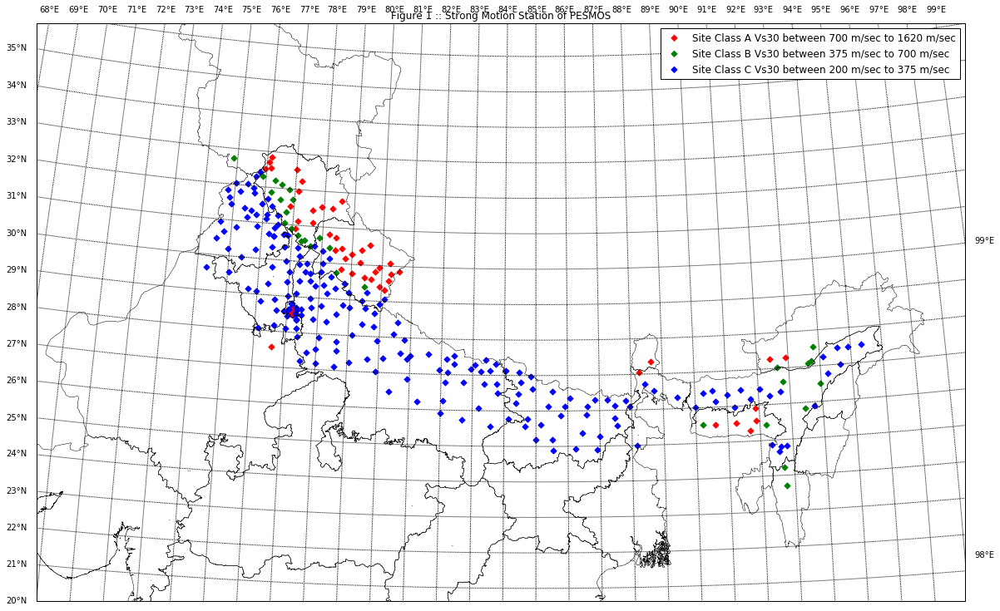

    pylab.rcParams['figure.figsize'] = (20, 15)
    from generating_figures import india_basemap
    import pickle
    import pandas as pd
    pd.set_option('display.max_rows', None)

    station_data_from_file = pickle.load( open( "station_data_from_file.pickle", "rb" ) )
    pesmos_stations_final_pd = pickle.load( open( "pesmos_stations_final_pd.pickle", "rb" ) )
    pesmos_stations_final_pd = pesmos_stations_final_pd.set_index('No')

# Introduction

PESMOS is a project initiated by Earthquake Engineering Department of Indian
Institute of Technology Roorkee to study the ground motion characteristics of
Himalayan earthquakes using strong motion accelerographs. The project was funded
by Department of Science and Technology (DST), Government of India. The strong
motion accelarograph network covers various region of Indian seismic zones V, IV
and some thickly populated cities of seismic zone III. Out of 245 installed
accelarograms 193 station have recorded various earthquake events as shown in
Figure 1.

    station_color = {'A':'r','B':'g', 'C':'b', 'D':'y'}
    m = india_basemap('./')
    for station in station_data_from_file:
        site_cls = station_data_from_file[station]['Site Class'][0]
        if '200' in station_data_from_file[station]['Site Class']:
            site_cls = 'C'
        m.scatter([station_data_from_file[station]['Longitude']],[station_data_from_file[station]['Latitude']],\
                  s=100,latlon=True,marker='D',color=station_color[site_cls])
    m.scatter([0],[0], s=200,latlon=True,marker='D',color='r', label='Site Class A Vs30 between 700 m/sec to 1620 m/sec')
    m.scatter([0],[0], s=200,latlon=True,marker='D',color='g', label='Site Class B Vs30 between 375 m/sec to 700 m/sec')
    m.scatter([0],[0], s=200,latlon=True,marker='D',color='b', label='Site Class C Vs30 between 200 m/sec to 375 m/sec')
    title('Figure 1 :: Strong Motion Station of PESMOS')
    legend(scatterpoints=1)

    <matplotlib.legend.Legend at 0x7f9d8a3aec90>

# Accelarograph Stations

Indian Institute of Technology Roorkee install approaximately 293 strong motion
accelarograph in and around the Himalayas. The sites where these accelarograph
stations located are in various classes of sites. These sites are classified
into Class A, Class B and Class C as shown in Figure 1. The accelarograph used
was AC-63 GeoSIG triaxial force-balanced accelerometers and GSR-18 GeoSIG
18-bit  digitizers  with  external  GPS. The recording for all instruments is in
trigger mode at a sampling frequency of 200 sps. The triggering threshold was
initially set at 0.005 g for all the instruments. List of accelarograph stations
are shown in Table 1.

    print "Table 1 : List of PESMOS Stations"
    display(pesmos_stations_final_pd)

    Table 1 : List of PESMOS Stations

<table border="1" class="dataframe">
  <thead>
    <tr style="text-align: right;">
      <th></th>
      <th>Code Name</th>
      <th>Location</th>
      <th>Name</th>
      <th>Record Available?</th>
      <th>Site Class</th>
      <th>Site Geology</th>
      <th>Station ID</th>
    </tr>
    <tr>
      <th>No</th>
      <th></th>
      <th></th>
      <th></th>
      <th></th>
      <th></th>
      <th></th>
      <th></th>
    </tr>
  </thead>
  <tbody>
    <tr>
      <th>1</th>
      <td>DJB</td>
      <td>Lat: 28.59,Lon: 77.17</td>
      <td>Dhaula Kuan</td>
      <td>Yes</td>
      <td>C</td>
      <td>Alluvium</td>
      <td>PDELH0004</td>
    </tr>
    <tr>
      <th>2</th>
      <td>DJB</td>
      <td>Lat: 28.66,Lon: 77.12</td>
      <td>Raja Garden</td>
      <td>Yes</td>
      <td>C</td>
      <td>Alluvium</td>
      <td>PDELH0005</td>
    </tr>
    <tr>
      <th>3</th>
      <td>DJB</td>
      <td>Lat: 28.66,Lon: 77.23</td>
      <td>Indraprastha University</td>
      <td>Yes</td>
      <td>C</td>
      <td>Alluvium</td>
      <td>PDELH0006</td>
    </tr>
    <tr>
      <th>4</th>
      <td>IGN</td>
      <td>Lat: 28.49,Lon: 77.20</td>
      <td>IGNOU</td>
      <td>Yes</td>
      <td>C</td>
      <td>Alluvium</td>
      <td>PDELH0007</td>
    </tr>
    <tr>
      <th>5</th>
      <td>--</td>
      <td>Lat: 30.44,Lon: 77.62</td>
      <td>Paonta Sahib</td>
      <td>No</td>
      <td>B</td>
      <td>sandstones</td>
      <td>PIITR0061</td>
    </tr>
    <tr>
      <th>6</th>
      <td>--</td>
      <td>Lat: 29.75,Lon: 79.02</td>
      <td>Dhumakot</td>
      <td>No</td>
      <td>A</td>
      <td>phyllites</td>
      <td>PIITR0018</td>
    </tr>
    <tr>
      <th>7</th>
      <td>--</td>
      <td>Lat: 30.05,Lon: 79.29</td>
      <td>Garsain</td>
      <td>No</td>
      <td>A</td>
      <td>schist, granodiorites, gneiss</td>
      <td>PIITR0019</td>
    </tr>
    <tr>
      <th>8</th>
      <td>DNLT</td>
      <td>Lat: 30.43,Lon: 78.24</td>
      <td>Dhanaulti</td>
      <td>Yes</td>
      <td>B</td>
      <td>slates/siltstones/limestones/sandstones</td>
      <td>PIITR0016</td>
    </tr>
    <tr>
      <th>9</th>
      <td>DRC</td>
      <td>Lat: 29.85,Lon: 80.55</td>
      <td>Dharchula</td>
      <td>Yes</td>
      <td>A</td>
      <td>phyllites/slates/limestones</td>
      <td>PIITR0017</td>
    </tr>
    <tr>
      <th>10</th>
      <td>BAR</td>
      <td>Lat: 30.81,Lon: 78.21</td>
      <td>Barkot</td>
      <td>Yes</td>
      <td>A</td>
      <td>granite/phyllite/slates</td>
      <td>PIITR0014</td>
    </tr>
    <tr>
      <th>11</th>
      <td>KR</td>
      <td>Lat: 30.69,Lon: 77.90</td>
      <td>Chakrata</td>
      <td>Yes</td>
      <td>B</td>
      <td>slitstones/slates</td>
      <td>PIITR0015</td>
    </tr>
    <tr>
      <th>12</th>
      <td>UDH</td>
      <td>Lat: 29.00,Lon: 79.40</td>
      <td>Udham Singh Nagar</td>
      <td>Yes</td>
      <td>C</td>
      <td>soil (slope washed)</td>
      <td>PIITR0012</td>
    </tr>
    <tr>
      <th>13</th>
      <td>MTLI</td>
      <td>Lat: 30.73,Lon: 78.44</td>
      <td>Uttarkashi</td>
      <td>Yes</td>
      <td>A</td>
      <td>quartzite/slates</td>
      <td>PIITR0013</td>
    </tr>
    <tr>
      <th>14</th>
      <td>DURD</td>
      <td>Lat: 30.29,Lon: 78.98</td>
      <td>Rudraprayag</td>
      <td>Yes</td>
      <td>A</td>
      <td>quartzite/slates</td>
      <td>PIITR0010</td>
    </tr>
    <tr>
      <th>15</th>
      <td>KDKL</td>
      <td>Lat: 30.37,Lon: 78.43</td>
      <td>Tehri</td>
      <td>Yes</td>
      <td>A</td>
      <td>phyllites</td>
      <td>PIITR0011</td>
    </tr>
    <tr>
      <th>16</th>
      <td>--</td>
      <td>Lat: 27.14,Lon: 83.54</td>
      <td>Maharaj Ganj</td>
      <td>No</td>
      <td>C</td>
      <td>Alluvium</td>
      <td>PIITR0157</td>
    </tr>
    <tr>
      <th>17</th>
      <td>--</td>
      <td>Lat: 26.85,Lon: 80.93</td>
      <td>Lucknow</td>
      <td>No</td>
      <td>C</td>
      <td>Alluvium</td>
      <td>PIITR0156</td>
    </tr>
    <tr>
      <th>18</th>
      <td>--</td>
      <td>Lat: 27.95,Lon: 80.79</td>
      <td>Lakhimpur</td>
      <td>No</td>
      <td>C</td>
      <td>Alluvium</td>
      <td>PIITR0155</td>
    </tr>
    <tr>
      <th>19</th>
      <td>--</td>
      <td>Lat: 26.75,Lon: 83.76</td>
      <td>KushuNagar</td>
      <td>No</td>
      <td>C</td>
      <td>Alluvium</td>
      <td>PIITR0154</td>
    </tr>
    <tr>
      <th>20</th>
      <td>--</td>
      <td>Lat: 26.48,Lon: 80.35</td>
      <td>Kanpur</td>
      <td>No</td>
      <td>C</td>
      <td>Alluvium</td>
      <td>PIITR0153</td>
    </tr>
    <tr>
      <th>21</th>
      <td>--</td>
      <td>Lat: 27.03,Lon: 79.92</td>
      <td>Kannauj</td>
      <td>No</td>
      <td>C</td>
      <td>Alluvium</td>
      <td>PIITR0152</td>
    </tr>
    <tr>
      <th>22</th>
      <td>--</td>
      <td>Lat: 25.73,Lon: 82.69</td>
      <td>Jaunpur</td>
      <td>No</td>
      <td>C</td>
      <td>Alluvium</td>
      <td>PIITR0151</td>
    </tr>
    <tr>
      <th>23</th>
      <td>--</td>
      <td>Lat: 27.58,Lon: 77.98</td>
      <td>Hathras</td>
      <td>No</td>
      <td>C</td>
      <td>Alluvium</td>
      <td>PIITR0150</td>
    </tr>
    <tr>
      <th>24</th>
      <td>--</td>
      <td>Lat: 25.77,Lon: 87.47</td>
      <td>Purnia</td>
      <td>No</td>
      <td>C</td>
      <td>Alluvium</td>
      <td>PIITR0221</td>
    </tr>
    <tr>
      <th>25</th>
      <td>--</td>
      <td>Lat: 25.62,Lon: 85.15</td>
      <td>Patna</td>
      <td>No</td>
      <td>C</td>
      <td>Alluvium</td>
      <td>PIITR0220</td>
    </tr>
    <tr>
      <th>26</th>
      <td>--</td>
      <td>Lat: 25.86,Lon: 85.78</td>
      <td>Samastipur</td>
      <td>No</td>
      <td>C</td>
      <td>Alluvium</td>
      <td>PIITR0223</td>
    </tr>
    <tr>
      <th>27</th>
      <td>--</td>
      <td>Lat: 25.89,Lon: 86.59</td>
      <td>Saharsa</td>
      <td>No</td>
      <td>C</td>
      <td>Alluvium</td>
      <td>PIITR0222</td>
    </tr>
    <tr>
      <th>28</th>
      <td>--</td>
      <td>Lat: 26.56,Lon: 85.52</td>
      <td>Sitamari</td>
      <td>No</td>
      <td>C</td>
      <td>Alluvium</td>
      <td>PIITR0225</td>
    </tr>
    <tr>
      <th>29</th>
      <td>--</td>
      <td>Lat: 26.13,Lon: 86.61</td>
      <td>Saupaul</td>
      <td>No</td>
      <td>C</td>
      <td>Alluvium</td>
      <td>PIITR0224</td>
    </tr>
    <tr>
      <th>30</th>
      <td>--</td>
      <td>Lat: 27.47,Lon: 77.69</td>
      <td>Mathura</td>
      <td>No</td>
      <td>C</td>
      <td>Alluvium</td>
      <td>PIITR0159</td>
    </tr>
    <tr>
      <th>31</th>
      <td>--</td>
      <td>Lat: 27.24,Lon: 79.05</td>
      <td>Mainpuri</td>
      <td>No</td>
      <td>C</td>
      <td>Alluvium</td>
      <td>PIITR0158</td>
    </tr>
    <tr>
      <th>32</th>
      <td>NKD</td>
      <td>Lat: 31.12,Lon: 75.49</td>
      <td>Nakodar</td>
      <td>Yes</td>
      <td>C</td>
      <td>Alluvium</td>
      <td>PIITR0096</td>
    </tr>
    <tr>
      <th>33</th>
      <td>PTK</td>
      <td>Lat: 32.27,Lon: 75.66</td>
      <td>Pathankot</td>
      <td>Yes</td>
      <td>C</td>
      <td>Alluvium</td>
      <td>PIITR0097</td>
    </tr>
    <tr>
      <th>34</th>
      <td>--</td>
      <td>Lat: 30.70,Lon: 76.24</td>
      <td>Khanna</td>
      <td>No</td>
      <td>C</td>
      <td>Alluvium</td>
      <td>PIITR0094</td>
    </tr>
    <tr>
      <th>35</th>
      <td>MUK</td>
      <td>Lat: 31.95,Lon: 75.61</td>
      <td>Mukerian</td>
      <td>Yes</td>
      <td>C</td>
      <td>Alluvium</td>
      <td>PIITR0095</td>
    </tr>
    <tr>
      <th>36</th>
      <td>DHR</td>
      <td>Lat: 32.41,Lon: 75.80</td>
      <td>Dhar Kalan</td>
      <td>Yes</td>
      <td>C</td>
      <td>Alluvium</td>
      <td>PIITR0092</td>
    </tr>
    <tr>
      <th>37</th>
      <td>GSK</td>
      <td>Lat: 31.23,Lon: 76.13</td>
      <td>GarhShankar</td>
      <td>Yes</td>
      <td>C</td>
      <td>Alluvium</td>
      <td>PIITR0093</td>
    </tr>
    <tr>
      <th>38</th>
      <td>DSU</td>
      <td>Lat: 31.81,Lon: 75.66</td>
      <td>Dasua</td>
      <td>Yes</td>
      <td>C</td>
      <td>Alluvium</td>
      <td>PIITR0090</td>
    </tr>
    <tr>
      <th>39</th>
      <td>--</td>
      <td>Lat: 32.04,Lon: 75.02</td>
      <td>Dera Baba Nanak</td>
      <td>No</td>
      <td>C</td>
      <td>Alluvium</td>
      <td>PIITR0091</td>
    </tr>
    <tr>
      <th>40</th>
      <td>--</td>
      <td>Lat: 29.15,Lon: 78.26</td>
      <td>Chandpur</td>
      <td>No</td>
      <td>C</td>
      <td>Alluvium</td>
      <td>PIITR0180</td>
    </tr>
    <tr>
      <th>41</th>
      <td>DJB</td>
      <td>Lat: 28.69,Lon: 77.21</td>
      <td>University of Delhi</td>
      <td>Yes</td>
      <td>C</td>
      <td>Alluvium</td>
      <td>PDELH0003</td>
    </tr>
    <tr>
      <th>42</th>
      <td>PHG</td>
      <td>Lat: 31.21,Lon: 75.77</td>
      <td>Phagwara</td>
      <td>Yes</td>
      <td>C</td>
      <td>Alluvium</td>
      <td>PIITR0098</td>
    </tr>
    <tr>
      <th>43</th>
      <td>--</td>
      <td>Lat: 30.37,Lon: 76.77</td>
      <td>Ambala</td>
      <td>No</td>
      <td>C</td>
      <td>Alluvium</td>
      <td>PIITR0099</td>
    </tr>
    <tr>
      <th>44</th>
      <td>DIM</td>
      <td>Lat: 25.90,Lon: 93.73</td>
      <td>Dimapur</td>
      <td>Yes</td>
      <td>C</td>
      <td>soils (slope washed)</td>
      <td>PIITR0278</td>
    </tr>
    <tr>
      <th>45</th>
      <td>BON</td>
      <td>Lat: 26.47,Lon: 90.56</td>
      <td>Bongaigaon</td>
      <td>Yes</td>
      <td>C</td>
      <td>soils (slope washed)</td>
      <td>PIITR0240</td>
    </tr>
    <tr>
      <th>46</th>
      <td>JWI</td>
      <td>Lat: 30.20,Lon: 74.95</td>
      <td>Bhatinda</td>
      <td>Yes</td>
      <td>C</td>
      <td>Alluvium</td>
      <td>PIITR0068</td>
    </tr>
    <tr>
      <th>47</th>
      <td>KAP</td>
      <td>Lat: 29.94,Lon: 79.90</td>
      <td>Kapkot</td>
      <td>Yes</td>
      <td>A</td>
      <td>dolomite/limestones</td>
      <td>PIITR0023</td>
    </tr>
    <tr>
      <th>48</th>
      <td>JSH</td>
      <td>Lat: 30.57,Lon: 79.58</td>
      <td>Joshimath</td>
      <td>Yes</td>
      <td>A</td>
      <td>granite/gneiss/quartzite</td>
      <td>PIITR0022</td>
    </tr>
    <tr>
      <th>49</th>
      <td>--</td>
      <td>Lat: 29.22,Lon: 79.53</td>
      <td>Haldwani</td>
      <td>No</td>
      <td>C</td>
      <td>soil (slope washed)</td>
      <td>PIITR0021</td>
    </tr>
    <tr>
      <th>50</th>
      <td>GHA</td>
      <td>Lat: 30.43,Lon: 78.66</td>
      <td>Ghansali</td>
      <td>Yes</td>
      <td>A</td>
      <td>quartzite/slates</td>
      <td>PIITR0020</td>
    </tr>
    <tr>
      <th>51</th>
      <td>--</td>
      <td>Lat: 29.74,Lon: 78.03</td>
      <td>Laksar</td>
      <td>No</td>
      <td>C</td>
      <td>alluvium</td>
      <td>PIITR0027</td>
    </tr>
    <tr>
      <th>52</th>
      <td>KOT</td>
      <td>Lat: 29.75,Lon: 78.52</td>
      <td>Kotdwar</td>
      <td>Yes</td>
      <td>B</td>
      <td>sandstones/shales</td>
      <td>PIITR0026</td>
    </tr>
    <tr>
      <th>53</th>
      <td>KHA</td>
      <td>Lat: 28.92,Lon: 79.97</td>
      <td>Khatima</td>
      <td>Yes</td>
      <td>C</td>
      <td>soils (slope washed)</td>
      <td>PIITR0025</td>
    </tr>
    <tr>
      <th>54</th>
      <td>KSH</td>
      <td>Lat: 29.21,Lon: 78.96</td>
      <td>Kashipur</td>
      <td>Yes</td>
      <td>C</td>
      <td>soils (slope washed)</td>
      <td>PIITR0024</td>
    </tr>
    <tr>
      <th>55</th>
      <td>--</td>
      <td>Lat: 28.40,Lon: 77.85</td>
      <td>BulandShahar</td>
      <td>No</td>
      <td>C</td>
      <td>Alluvium</td>
      <td>PIITR0140</td>
    </tr>
    <tr>
      <th>56</th>
      <td>--</td>
      <td>Lat: 26.50,Lon: 83.78</td>
      <td>Devria</td>
      <td>No</td>
      <td>C</td>
      <td>Alluvium</td>
      <td>PIITR0141</td>
    </tr>
    <tr>
      <th>57</th>
      <td>MUN</td>
      <td>Lat: 30.07,Lon: 80.24</td>
      <td>Munsyari</td>
      <td>Yes</td>
      <td>A</td>
      <td>schist, granodiorites, gneiss</td>
      <td>PIITR0029</td>
    </tr>
    <tr>
      <th>58</th>
      <td>LAN</td>
      <td>Lat: 29.84,Lon: 78.68</td>
      <td>Lansdown</td>
      <td>Yes</td>
      <td>A</td>
      <td>schist, granodiorites, gneiss</td>
      <td>PIITR0028</td>
    </tr>
    <tr>
      <th>59</th>
      <td>--</td>
      <td>Lat: 27.36,Lon: 79.64</td>
      <td>Farrukhabad</td>
      <td>No</td>
      <td>C</td>
      <td>Alluvium</td>
      <td>PIITR0144</td>
    </tr>
    <tr>
      <th>60</th>
      <td>--</td>
      <td>Lat: 28.67,Lon: 77.45</td>
      <td>Gaziabad</td>
      <td>No</td>
      <td>C</td>
      <td>Alluvium</td>
      <td>PIITR0145</td>
    </tr>
    <tr>
      <th>61</th>
      <td>--</td>
      <td>Lat: 25.57,Lon: 83.57</td>
      <td>Gazipur</td>
      <td>No</td>
      <td>C</td>
      <td>Alluvium</td>
      <td>PIITR0146</td>
    </tr>
    <tr>
      <th>62</th>
      <td>--</td>
      <td>Lat: 27.13,Lon: 81.94</td>
      <td>Gonda</td>
      <td>No</td>
      <td>C</td>
      <td>Alluvium</td>
      <td>PIITR0147</td>
    </tr>
    <tr>
      <th>63</th>
      <td>GTK</td>
      <td>Lat: 27.35,Lon: 88.63</td>
      <td>Gangtok</td>
      <td>Yes</td>
      <td>A</td>
      <td>gneiss/schist</td>
      <td>PIITR0238</td>
    </tr>
    <tr>
      <th>64</th>
      <td>--</td>
      <td>Lat: 26.33,Lon: 91.01</td>
      <td>Barpeta</td>
      <td>No</td>
      <td>C</td>
      <td>Alluvium</td>
      <td>PIITR0239</td>
    </tr>
    <tr>
      <th>65</th>
      <td>RAX</td>
      <td>Lat: 26.98,Lon: 84.84</td>
      <td>Raxaul</td>
      <td>Yes</td>
      <td>C</td>
      <td>Alluvium</td>
      <td>PIITR0232</td>
    </tr>
    <tr>
      <th>66</th>
      <td>DJL</td>
      <td>Lat: 27.05,Lon: 88.26</td>
      <td>Darjeeling</td>
      <td>Yes</td>
      <td>A</td>
      <td>gneiss/schist</td>
      <td>PIITR0233</td>
    </tr>
    <tr>
      <th>67</th>
      <td>--</td>
      <td>Lat: 27.10,Lon: 84.46</td>
      <td>NarkatraGanj</td>
      <td>No</td>
      <td>C</td>
      <td>Alluvium</td>
      <td>PIITR0230</td>
    </tr>
    <tr>
      <th>68</th>
      <td>--</td>
      <td>Lat: 26.30,Lon: 86.84</td>
      <td>Raghopur</td>
      <td>No</td>
      <td>C</td>
      <td>Alluvium</td>
      <td>PIITR0231</td>
    </tr>
    <tr>
      <th>69</th>
      <td>MLD</td>
      <td>Lat: 25.00,Lon: 88.15</td>
      <td>Malda</td>
      <td>Yes</td>
      <td>C</td>
      <td>Alluvium</td>
      <td>PIITR0236</td>
    </tr>
    <tr>
      <th>70</th>
      <td>LG</td>
      <td>Lat: 26.71,Lon: 88.43</td>
      <td>Siliguri</td>
      <td>Yes</td>
      <td>C</td>
      <td>soils (slope washed)</td>
      <td>PIITR0237</td>
    </tr>
    <tr>
      <th>71</th>
      <td>--</td>
      <td>Lat: 26.52,Lon: 88.73</td>
      <td>Jalpaiguri</td>
      <td>No</td>
      <td>C</td>
      <td>Alluvium</td>
      <td>PIITR0234</td>
    </tr>
    <tr>
      <th>72</th>
      <td>OB</td>
      <td>Lat: 26.32,Lon: 89.44</td>
      <td>Kooch Vihar</td>
      <td>Yes</td>
      <td>C</td>
      <td>Alluvium</td>
      <td>PIITR0235</td>
    </tr>
    <tr>
      <th>73</th>
      <td>--</td>
      <td>Lat: 26.30,Lon: 87.25</td>
      <td>Forbesganj</td>
      <td>No</td>
      <td>C</td>
      <td>Alluvium</td>
      <td>PIITR0229</td>
    </tr>
    <tr>
      <th>74</th>
      <td>--</td>
      <td>Lat: 26.26,Lon: 87.83</td>
      <td>Bahadurganj</td>
      <td>No</td>
      <td>C</td>
      <td>Alluvium</td>
      <td>PIITR0228</td>
    </tr>
    <tr>
      <th>75</th>
      <td>--</td>
      <td>Lat: 32.52,Lon: 75.96</td>
      <td>Dalhousie</td>
      <td>No</td>
      <td>A</td>
      <td>Quartzite, gneiss, schist, phyllite</td>
      <td>PIITR0050</td>
    </tr>
    <tr>
      <th>76</th>
      <td>--</td>
      <td>Lat: 29.38,Lon: 79.46</td>
      <td>Nainital</td>
      <td>No</td>
      <td>B</td>
      <td>sandstones/slates/limestones/dolomites</td>
      <td>PIITR0007</td>
    </tr>
    <tr>
      <th>77</th>
      <td>NON</td>
      <td>Lat: 25.52,Lon: 91.26</td>
      <td>Nongstoin</td>
      <td>Yes</td>
      <td>A</td>
      <td>granite</td>
      <td>PIITR0266</td>
    </tr>
    <tr>
      <th>78</th>
      <td>--</td>
      <td>Lat: 30.68,Lon: 74.76</td>
      <td>Faridkot</td>
      <td>No</td>
      <td>C</td>
      <td>Alluvium</td>
      <td>PIITR0069</td>
    </tr>
    <tr>
      <th>79</th>
      <td>BHA</td>
      <td>Lat: 31.55,Lon: 77.92</td>
      <td>Nathhpa</td>
      <td>Yes</td>
      <td>A</td>
      <td>gneissic complex</td>
      <td>PIITR0056</td>
    </tr>
    <tr>
      <th>80</th>
      <td>--</td>
      <td>Lat: 31.99,Lon: 76.80</td>
      <td>Jogindernager</td>
      <td>No</td>
      <td>B</td>
      <td>sandstones/shales</td>
      <td>PIITR0057</td>
    </tr>
    <tr>
      <th>81</th>
      <td>DDH</td>
      <td>Lat: 29.77,Lon: 80.30</td>
      <td>Didihat</td>
      <td>Yes</td>
      <td>A</td>
      <td>schist, granodiorites, gneiss</td>
      <td>PIITR0034</td>
    </tr>
    <tr>
      <th>82</th>
      <td>VIK</td>
      <td>Lat: 30.45,Lon: 77.75</td>
      <td>Vikasnagar</td>
      <td>Yes</td>
      <td>C</td>
      <td>soils (slope washed)</td>
      <td>PIITR0035</td>
    </tr>
    <tr>
      <th>83</th>
      <td>BIL</td>
      <td>Lat: 31.34,Lon: 76.76</td>
      <td>Bilaspur</td>
      <td>Yes</td>
      <td>B</td>
      <td>sandstones/shales</td>
      <td>PIITR0036</td>
    </tr>
    <tr>
      <th>84</th>
      <td>HM</td>
      <td>Lat: 32.55,Lon: 76.13</td>
      <td>Chamba</td>
      <td>Yes</td>
      <td>A</td>
      <td>granitoids</td>
      <td>PIITR0037</td>
    </tr>
    <tr>
      <th>85</th>
      <td>PTI</td>
      <td>Lat: 29.41,Lon: 79.93</td>
      <td>Patti</td>
      <td>Yes</td>
      <td>A</td>
      <td>schist, granodiorites, gneiss</td>
      <td>PIITR0030</td>
    </tr>
    <tr>
      <th>86</th>
      <td>--</td>
      <td>Lat: 29.64,Lon: 79.43</td>
      <td>Ranikhet</td>
      <td>No</td>
      <td>A</td>
      <td>schist, granodiorites, gneiss</td>
      <td>PIITR0031</td>
    </tr>
    <tr>
      <th>87</th>
      <td>RIS</td>
      <td>Lat: 30.12,Lon: 78.28</td>
      <td>Rishikesh</td>
      <td>Yes</td>
      <td>C</td>
      <td>soils (slope washed)</td>
      <td>PIITR0032</td>
    </tr>
    <tr>
      <th>88</th>
      <td>TAN</td>
      <td>Lat: 29.07,Lon: 80.11</td>
      <td>Tanakpur</td>
      <td>Yes</td>
      <td>C</td>
      <td>alluvium</td>
      <td>PIITR0033</td>
    </tr>
    <tr>
      <th>89</th>
      <td>--</td>
      <td>Lat: 25.77,Lon: 84.14</td>
      <td>Balia</td>
      <td>No</td>
      <td>C</td>
      <td>Alluvium</td>
      <td>PIITR0135</td>
    </tr>
    <tr>
      <th>90</th>
      <td>--</td>
      <td>Lat: 27.57,Lon: 81.59</td>
      <td>Bahraich</td>
      <td>No</td>
      <td>C</td>
      <td>Alluvium</td>
      <td>PIITR0134</td>
    </tr>
    <tr>
      <th>91</th>
      <td>--</td>
      <td>Lat: 28.34,Lon: 79.42</td>
      <td>Bareilly</td>
      <td>No</td>
      <td>C</td>
      <td>Alluvium</td>
      <td>PIITR0137</td>
    </tr>
    <tr>
      <th>92</th>
      <td>--</td>
      <td>Lat: 27.44,Lon: 82.17</td>
      <td>Balrampur</td>
      <td>No</td>
      <td>C</td>
      <td>Alluvium</td>
      <td>PIITR0136</td>
    </tr>
    <tr>
      <th>93</th>
      <td>DSL</td>
      <td>Lat: 32.21,Lon: 76.32</td>
      <td>Dharamshala</td>
      <td>Yes</td>
      <td>B</td>
      <td>sandstones/shales</td>
      <td>PIITR0038</td>
    </tr>
    <tr>
      <th>94</th>
      <td>HAM</td>
      <td>Lat: 31.69,Lon: 76.52</td>
      <td>Hamirpur</td>
      <td>Yes</td>
      <td>B</td>
      <td>sandstones/shales</td>
      <td>PIITR0039</td>
    </tr>
    <tr>
      <th>95</th>
      <td>--</td>
      <td>Lat: 28.02,Lon: 79.13</td>
      <td>Badaun</td>
      <td>No</td>
      <td>C</td>
      <td>Alluvium</td>
      <td>PIITR0133</td>
    </tr>
    <tr>
      <th>96</th>
      <td>--</td>
      <td>Lat: 26.06,Lon: 83.19</td>
      <td>Azamgarh</td>
      <td>No</td>
      <td>C</td>
      <td>Alluvium</td>
      <td>PIITR0132</td>
    </tr>
    <tr>
      <th>97</th>
      <td>--</td>
      <td>Lat: 26.12,Lon: 85.90</td>
      <td>Darbhanga</td>
      <td>No</td>
      <td>C</td>
      <td>Alluvium</td>
      <td>PIITR0209</td>
    </tr>
    <tr>
      <th>98</th>
      <td>--</td>
      <td>Lat: 25.78,Lon: 84.74</td>
      <td>Chapra</td>
      <td>No</td>
      <td>C</td>
      <td>Alluvium</td>
      <td>PIITR0208</td>
    </tr>
    <tr>
      <th>99</th>
      <td>--</td>
      <td>Lat: 25.20,Lon: 85.52</td>
      <td>Bihar Shariff</td>
      <td>No</td>
      <td>C</td>
      <td>Alluvium</td>
      <td>PIITR0207</td>
    </tr>
    <tr>
      <th>100</th>
      <td>--</td>
      <td>Lat: 25.26,Lon: 86.99</td>
      <td>Bhagalpur</td>
      <td>No</td>
      <td>C</td>
      <td>Alluvium</td>
      <td>PIITR0206</td>
    </tr>
    <tr>
      <th>101</th>
      <td>--</td>
      <td>Lat: 26.80,Lon: 84.52</td>
      <td>Bettiah</td>
      <td>No</td>
      <td>C</td>
      <td>Alluvium</td>
      <td>PIITR0205</td>
    </tr>
    <tr>
      <th>102</th>
      <td>--</td>
      <td>Lat: 24.89,Lon: 86.91</td>
      <td>Banka</td>
      <td>No</td>
      <td>C</td>
      <td>Alluvium</td>
      <td>PIITR0204</td>
    </tr>
    <tr>
      <th>103</th>
      <td>ARI</td>
      <td>Lat: 26.13,Lon: 87.47</td>
      <td>Araria</td>
      <td>Yes</td>
      <td>C</td>
      <td>Alluvium</td>
      <td>PIITR0203</td>
    </tr>
    <tr>
      <th>104</th>
      <td>--</td>
      <td>Lat: 32.30,Lon: 75.88</td>
      <td>Nurpur</td>
      <td>No</td>
      <td>B</td>
      <td>sandstones/shales</td>
      <td>PIITR0058</td>
    </tr>
    <tr>
      <th>105</th>
      <td>--</td>
      <td>Lat: 27.31,Lon: 82.41</td>
      <td>Utraula</td>
      <td>No</td>
      <td>C</td>
      <td>Alluvium</td>
      <td>PIITR0201</td>
    </tr>
    <tr>
      <th>106</th>
      <td>--</td>
      <td>Lat: 27.53,Lon: 82.40</td>
      <td>Tulsipur(Jarwa)</td>
      <td>No</td>
      <td>C</td>
      <td>Alluvium</td>
      <td>PIITR0200</td>
    </tr>
    <tr>
      <th>107</th>
      <td>--</td>
      <td>Lat: 30.72,Lon: 77.19</td>
      <td>Pachchhad</td>
      <td>No</td>
      <td>B</td>
      <td>sandstones/shales</td>
      <td>PIITR0059</td>
    </tr>
    <tr>
      <th>108</th>
      <td>HA</td>
      <td>Lat: 30.41,Lon: 79.32</td>
      <td>Chamoli</td>
      <td>Yes</td>
      <td>A</td>
      <td>quartzite, dolomites</td>
      <td>PIITR0003</td>
    </tr>
    <tr>
      <th>109</th>
      <td>--</td>
      <td>Lat: 28.59,Lon: 78.58</td>
      <td>Sambhal</td>
      <td>No</td>
      <td>C</td>
      <td>Alluvium</td>
      <td>PIITR0197</td>
    </tr>
    <tr>
      <th>110</th>
      <td>PAU</td>
      <td>Lat: 30.15,Lon: 78.78</td>
      <td>Pauri</td>
      <td>Yes</td>
      <td>A</td>
      <td>phyllites</td>
      <td>PIITR0008</td>
    </tr>
    <tr>
      <th>111</th>
      <td>--</td>
      <td>Lat: 27.11,Lon: 83.27</td>
      <td>Pharenda</td>
      <td>No</td>
      <td>C</td>
      <td>Alluvium</td>
      <td>PIITR0196</td>
    </tr>
    <tr>
      <th>112</th>
      <td>--</td>
      <td>Lat: 28.99,Lon: 77.72</td>
      <td>Meerut</td>
      <td>No</td>
      <td>C</td>
      <td>Alluvium</td>
      <td>PIITR0160</td>
    </tr>
    <tr>
      <th>113</th>
      <td>--</td>
      <td>Lat: 30.32,Lon: 78.04</td>
      <td>Dehradun</td>
      <td>No</td>
      <td>C</td>
      <td>soil (slope washed)</td>
      <td>PIITR0005</td>
    </tr>
    <tr>
      <th>114</th>
      <td>TAR</td>
      <td>Lat: 31.45,Lon: 74.93</td>
      <td>Taran Taran</td>
      <td>Yes</td>
      <td>C</td>
      <td>Alluvium</td>
      <td>PIITR0085</td>
    </tr>
    <tr>
      <th>115</th>
      <td>--</td>
      <td>Lat: 27.13,Lon: 84.06</td>
      <td>Bagha</td>
      <td>No</td>
      <td>C</td>
      <td>Alluvium</td>
      <td>PIITR0227</td>
    </tr>
    <tr>
      <th>116</th>
      <td>HP</td>
      <td>Lat: 29.33,Lon: 80.09</td>
      <td>Champawat</td>
      <td>Yes</td>
      <td>A</td>
      <td>granite</td>
      <td>PIITR0004</td>
    </tr>
    <tr>
      <th>117</th>
      <td>AMB</td>
      <td>Lat: 31.69,Lon: 76.12</td>
      <td>Amb</td>
      <td>Yes</td>
      <td>C</td>
      <td>soils (slope washed)</td>
      <td>PIITR0048</td>
    </tr>
    <tr>
      <th>118</th>
      <td>--</td>
      <td>Lat: 26.23,Lon: 84.36</td>
      <td>Siwan</td>
      <td>No</td>
      <td>C</td>
      <td>Alluvium</td>
      <td>PIITR0226</td>
    </tr>
    <tr>
      <th>119</th>
      <td>LKH</td>
      <td>Lat: 27.24,Lon: 94.11</td>
      <td>North Lakhimpur</td>
      <td>Yes</td>
      <td>C</td>
      <td>Alluvium</td>
      <td>PIITR0256</td>
    </tr>
    <tr>
      <th>120</th>
      <td>--</td>
      <td>Lat: 29.97,Lon: 78.07</td>
      <td>Haridwar</td>
      <td>No</td>
      <td>C</td>
      <td>alluvium</td>
      <td>PIITR0006</td>
    </tr>
    <tr>
      <th>121</th>
      <td>--</td>
      <td>Lat:  9.18,Lon: 92.82</td>
      <td>Car Nicobar</td>
      <td>No</td>
      <td>B</td>
      <td>sandstones/shales</td>
      <td>PIITR0128</td>
    </tr>
    <tr>
      <th>122</th>
      <td>POR</td>
      <td>Lat: 11.66,Lon: 92.74</td>
      <td>Port Blair</td>
      <td>Yes</td>
      <td>B</td>
      <td>sandstones/shales</td>
      <td>PIITR0129</td>
    </tr>
    <tr>
      <th>123</th>
      <td>--</td>
      <td>Lat: 29.63,Lon: 74.29</td>
      <td>Hanumangarh</td>
      <td>No</td>
      <td>C</td>
      <td>Aeolian</td>
      <td>PIITR0126</td>
    </tr>
    <tr>
      <th>124</th>
      <td>JMU</td>
      <td>Lat: 32.73,Lon: 74.87</td>
      <td>Jammu</td>
      <td>Yes</td>
      <td>B</td>
      <td>sandstones/shales</td>
      <td>PIITR0127</td>
    </tr>
    <tr>
      <th>125</th>
      <td>ALW</td>
      <td>Lat: 27.57,Lon: 76.59</td>
      <td>Alwar</td>
      <td>Yes</td>
      <td>A</td>
      <td>gneiss/schist</td>
      <td>PIITR0124</td>
    </tr>
    <tr>
      <th>126</th>
      <td>--</td>
      <td>Lat: 27.21,Lon: 77.51</td>
      <td>Bharatpur</td>
      <td>No</td>
      <td>C</td>
      <td>Aeolian</td>
      <td>PIITR0125</td>
    </tr>
    <tr>
      <th>127</th>
      <td>PAL</td>
      <td>Lat: 28.13,Lon: 77.33</td>
      <td>Palwal</td>
      <td>Yes</td>
      <td>C</td>
      <td>Alluvium</td>
      <td>PIITR0122</td>
    </tr>
    <tr>
      <th>128</th>
      <td>--</td>
      <td>Lat: 30.38,Lon: 77.22</td>
      <td>Sadhura</td>
      <td>No</td>
      <td>C</td>
      <td>Alluvium</td>
      <td>PIITR0123</td>
    </tr>
    <tr>
      <th>129</th>
      <td>--</td>
      <td>Lat: 29.09,Lon: 75.96</td>
      <td>Hansi</td>
      <td>No</td>
      <td>C</td>
      <td>Alluvium</td>
      <td>PIITR0120</td>
    </tr>
    <tr>
      <th>130</th>
      <td>--</td>
      <td>Lat: 27.89,Lon: 77.38</td>
      <td>Hodal</td>
      <td>No</td>
      <td>C</td>
      <td>Alluvium</td>
      <td>PIITR0121</td>
    </tr>
    <tr>
      <th>131</th>
      <td>KLU</td>
      <td>Lat: 31.96,Lon: 77.11</td>
      <td>Kullu</td>
      <td>Yes</td>
      <td>A</td>
      <td>phyllite, quartzite, schist, gneiss</td>
      <td>PIITR0041</td>
    </tr>
    <tr>
      <th>132</th>
      <td>KLG</td>
      <td>Lat: 32.56,Lon: 77.01</td>
      <td>Keylong</td>
      <td>Yes</td>
      <td>A</td>
      <td>phyllite, quartzite, schist</td>
      <td>PIITR0040</td>
    </tr>
    <tr>
      <th>133</th>
      <td>--</td>
      <td>Lat: 30.56,Lon: 77.30</td>
      <td>Nahan</td>
      <td>No</td>
      <td>B</td>
      <td>sandstones/shales</td>
      <td>PIITR0043</td>
    </tr>
    <tr>
      <th>134</th>
      <td>MND</td>
      <td>Lat: 31.71,Lon: 76.93</td>
      <td>Mandi</td>
      <td>Yes</td>
      <td>B</td>
      <td>sandstones/shales</td>
      <td>PIITR0042</td>
    </tr>
    <tr>
      <th>135</th>
      <td>--</td>
      <td>Lat: 31.11,Lon: 77.17</td>
      <td>Shimla</td>
      <td>No</td>
      <td>A</td>
      <td>Quartzite, gneiss, schist</td>
      <td>PIITR0045</td>
    </tr>
    <tr>
      <th>136</th>
      <td>PEO</td>
      <td>Lat: 31.54,Lon: 78.27</td>
      <td>RekongPeo</td>
      <td>Yes</td>
      <td>A</td>
      <td>granitoids and basic volcanics, gneiss and mag...</td>
      <td>PIITR0044</td>
    </tr>
    <tr>
      <th>137</th>
      <td>--</td>
      <td>Lat: 26.63,Lon: 84.90</td>
      <td>Motihari</td>
      <td>No</td>
      <td>C</td>
      <td>Alluvium</td>
      <td>PIITR0216</td>
    </tr>
    <tr>
      <th>138</th>
      <td>--</td>
      <td>Lat: 25.38,Lon: 86.46</td>
      <td>Munger</td>
      <td>No</td>
      <td>C</td>
      <td>Alluvium</td>
      <td>PIITR0217</td>
    </tr>
    <tr>
      <th>139</th>
      <td>--</td>
      <td>Lat: 26.12,Lon: 85.38</td>
      <td>Muzzafarpur</td>
      <td>No</td>
      <td>C</td>
      <td>Alluvium</td>
      <td>PIITR0218</td>
    </tr>
    <tr>
      <th>140</th>
      <td>--</td>
      <td>Lat: 24.89,Lon: 85.54</td>
      <td>Navada</td>
      <td>No</td>
      <td>C</td>
      <td>Alluvium</td>
      <td>PIITR0219</td>
    </tr>
    <tr>
      <th>141</th>
      <td>BAG</td>
      <td>Lat: 29.83,Lon: 79.77</td>
      <td>Bageshwar</td>
      <td>Yes</td>
      <td>A</td>
      <td>quartzite, dolomites</td>
      <td>PIITR0002</td>
    </tr>
    <tr>
      <th>142</th>
      <td>JNU</td>
      <td>Lat: 28.55,Lon: 77.19</td>
      <td>IIT Delhi</td>
      <td>Yes</td>
      <td>C</td>
      <td>Alluvium</td>
      <td>PDELH0011</td>
    </tr>
    <tr>
      <th>143</th>
      <td>--</td>
      <td>Lat: 26.47,Lon: 84.44</td>
      <td>Gopalganj</td>
      <td>No</td>
      <td>C</td>
      <td>Alluvium</td>
      <td>PIITR0210</td>
    </tr>
    <tr>
      <th>144</th>
      <td>--</td>
      <td>Lat: 24.93,Lon: 86.23</td>
      <td>Jamui</td>
      <td>No</td>
      <td>C</td>
      <td>Alluvium</td>
      <td>PIITR0211</td>
    </tr>
    <tr>
      <th>145</th>
      <td>DCE</td>
      <td>Lat: 28.80,Lon: 77.12</td>
      <td>DCE, Bawana Road</td>
      <td>Yes</td>
      <td>C</td>
      <td>Alluvium</td>
      <td>PDELH0002</td>
    </tr>
    <tr>
      <th>146</th>
      <td>--</td>
      <td>Lat: 31.04,Lon: 76.72</td>
      <td>Nalagarh</td>
      <td>No</td>
      <td>B</td>
      <td>sandstones/shales</td>
      <td>PIITR0055</td>
    </tr>
    <tr>
      <th>147</th>
      <td>--</td>
      <td>Lat: 25.20,Lon: 84.99</td>
      <td>jehanabad</td>
      <td>No</td>
      <td>C</td>
      <td>Alluvium</td>
      <td>PIITR0212</td>
    </tr>
    <tr>
      <th>148</th>
      <td>--</td>
      <td>Lat: 25.56,Lon: 87.55</td>
      <td>Katihar</td>
      <td>No</td>
      <td>C</td>
      <td>Alluvium</td>
      <td>PIITR0213</td>
    </tr>
    <tr>
      <th>149</th>
      <td>KSN</td>
      <td>Lat: 26.10,Lon: 87.95</td>
      <td>kishanganj</td>
      <td>Yes</td>
      <td>C</td>
      <td>Alluvium</td>
      <td>PIITR0214</td>
    </tr>
    <tr>
      <th>150</th>
      <td>--</td>
      <td>Lat: 30.90,Lon: 75.84</td>
      <td>Ludhiana</td>
      <td>No</td>
      <td>C</td>
      <td>Alluvium</td>
      <td>PIITR0076</td>
    </tr>
    <tr>
      <th>151</th>
      <td>--</td>
      <td>Lat: 26.35,Lon: 86.07</td>
      <td>Madhubani</td>
      <td>No</td>
      <td>C</td>
      <td>Alluvium</td>
      <td>PIITR0215</td>
    </tr>
    <tr>
      <th>152</th>
      <td>--</td>
      <td>Lat: 30.70,Lon: 76.87</td>
      <td>Panchkula</td>
      <td>No</td>
      <td>C</td>
      <td>Alluvium</td>
      <td>PIITR0113</td>
    </tr>
    <tr>
      <th>153</th>
      <td>--</td>
      <td>Lat: 29.40,Lon: 76.95</td>
      <td>Panipat</td>
      <td>No</td>
      <td>C</td>
      <td>Alluvium</td>
      <td>PIITR0112</td>
    </tr>
    <tr>
      <th>154</th>
      <td>--</td>
      <td>Lat: 28.06,Lon: 76.11</td>
      <td>Narnaul</td>
      <td>No</td>
      <td>C</td>
      <td>Alluvium</td>
      <td>PIITR0111</td>
    </tr>
    <tr>
      <th>155</th>
      <td>--</td>
      <td>Lat: 28.09,Lon: 77.00</td>
      <td>Mewat</td>
      <td>No</td>
      <td>C</td>
      <td>Alluvium</td>
      <td>PIITR0110</td>
    </tr>
    <tr>
      <th>156</th>
      <td>ON</td>
      <td>Lat: 29.00,Lon: 77.00</td>
      <td>Sonipat</td>
      <td>Yes</td>
      <td>C</td>
      <td>Alluvium</td>
      <td>PIITR0117</td>
    </tr>
    <tr>
      <th>157</th>
      <td>UNA</td>
      <td>Lat: 31.47,Lon: 76.26</td>
      <td>Una</td>
      <td>Yes</td>
      <td>C</td>
      <td>soils (slope washed)</td>
      <td>PIITR0047</td>
    </tr>
    <tr>
      <th>158</th>
      <td>ROH</td>
      <td>Lat: 28.90,Lon: 76.59</td>
      <td>Rohtak</td>
      <td>Yes</td>
      <td>C</td>
      <td>Alluvium</td>
      <td>PIITR0115</td>
    </tr>
    <tr>
      <th>159</th>
      <td>REW</td>
      <td>Lat: 28.18,Lon: 76.61</td>
      <td>Rewari</td>
      <td>Yes</td>
      <td>C</td>
      <td>Alluvium</td>
      <td>PIITR0114</td>
    </tr>
    <tr>
      <th>160</th>
      <td>BAL</td>
      <td>Lat: 28.34,Lon: 77.32</td>
      <td>Ballabhgarh</td>
      <td>Yes</td>
      <td>C</td>
      <td>Alluvium</td>
      <td>PIITR0119</td>
    </tr>
    <tr>
      <th>161</th>
      <td>OL</td>
      <td>Lat: 30.91,Lon: 77.10</td>
      <td>Solan</td>
      <td>Yes</td>
      <td>A</td>
      <td>limestones, dolomite, sandstones</td>
      <td>PIITR0046</td>
    </tr>
    <tr>
      <th>162</th>
      <td>ANS</td>
      <td>Lat: 31.24,Lon: 76.49</td>
      <td>Anandpur Saheb</td>
      <td>Yes</td>
      <td>C</td>
      <td>Alluvium</td>
      <td>PIITR0087</td>
    </tr>
    <tr>
      <th>163</th>
      <td>JUB</td>
      <td>Lat: 31.11,Lon: 77.66</td>
      <td>Jubbal</td>
      <td>Yes</td>
      <td>A</td>
      <td>granitoids and basic volcanics,gneiss and magm...</td>
      <td>PIITR0052</td>
    </tr>
    <tr>
      <th>164</th>
      <td>--</td>
      <td>Lat: 25.44,Lon: 92.20</td>
      <td>Jowai</td>
      <td>No</td>
      <td>B</td>
      <td>sandstones</td>
      <td>PIITR0264</td>
    </tr>
    <tr>
      <th>165</th>
      <td>--</td>
      <td>Lat: 27.11,Lon: 78.58</td>
      <td>Shikohabad</td>
      <td>No</td>
      <td>C</td>
      <td>Alluvium</td>
      <td>PIITR0199</td>
    </tr>
    <tr>
      <th>166</th>
      <td>--</td>
      <td>Lat: 29.46,Lon: 77.34</td>
      <td>Shamli</td>
      <td>No</td>
      <td>C</td>
      <td>Alluvium</td>
      <td>PIITR0198</td>
    </tr>
    <tr>
      <th>167</th>
      <td>BOK</td>
      <td>Lat: 25.98,Lon: 91.23</td>
      <td>Boko</td>
      <td>Yes</td>
      <td>C</td>
      <td>Alluvium</td>
      <td>PIITR0261</td>
    </tr>
    <tr>
      <th>168</th>
      <td>TIN</td>
      <td>Lat: 27.50,Lon: 95.33</td>
      <td>Tinsukia</td>
      <td>Yes</td>
      <td>C</td>
      <td>Alluvium</td>
      <td>PIITR0260</td>
    </tr>
    <tr>
      <th>169</th>
      <td>MNL</td>
      <td>Lat: 32.25,Lon: 77.19</td>
      <td>Manali</td>
      <td>Yes</td>
      <td>A</td>
      <td>phyllite, quartzite, schist, gneiss</td>
      <td>PIITR0054</td>
    </tr>
    <tr>
      <th>170</th>
      <td>--</td>
      <td>Lat: 24.82,Lon: 92.62</td>
      <td>KataKhal</td>
      <td>No</td>
      <td>C</td>
      <td>Alluvium</td>
      <td>PIITR0262</td>
    </tr>
    <tr>
      <th>171</th>
      <td>--</td>
      <td>Lat: 29.61,Lon: 78.35</td>
      <td>Nazibabad</td>
      <td>No</td>
      <td>C</td>
      <td>Alluvium</td>
      <td>PIITR0193</td>
    </tr>
    <tr>
      <th>172</th>
      <td>--</td>
      <td>Lat: 27.44,Lon: 83.42</td>
      <td>Nautanwa</td>
      <td>No</td>
      <td>C</td>
      <td>Alluvium</td>
      <td>PIITR0192</td>
    </tr>
    <tr>
      <th>173</th>
      <td>--</td>
      <td>Lat: 29.92,Lon: 77.30</td>
      <td>Nakur(Gangoh)</td>
      <td>No</td>
      <td>C</td>
      <td>Alluvium</td>
      <td>PIITR0191</td>
    </tr>
    <tr>
      <th>174</th>
      <td>--</td>
      <td>Lat: 27.06,Lon: 82.21</td>
      <td>Mankapur</td>
      <td>No</td>
      <td>C</td>
      <td>Alluvium</td>
      <td>PIITR0190</td>
    </tr>
    <tr>
      <th>175</th>
      <td>--</td>
      <td>Lat: 25.51,Lon: 90.60</td>
      <td>William nagar</td>
      <td>No</td>
      <td>A</td>
      <td>gneiss complex</td>
      <td>PIITR0269</td>
    </tr>
    <tr>
      <th>176</th>
      <td>TUR</td>
      <td>Lat: 25.51,Lon: 90.22</td>
      <td>Tura</td>
      <td>Yes</td>
      <td>B</td>
      <td>sandstones</td>
      <td>PIITR0268</td>
    </tr>
    <tr>
      <th>177</th>
      <td>--</td>
      <td>Lat: 28.43,Lon: 80.58</td>
      <td>Palia</td>
      <td>No</td>
      <td>C</td>
      <td>Alluvium</td>
      <td>PIITR0195</td>
    </tr>
    <tr>
      <th>178</th>
      <td>--</td>
      <td>Lat: 27.31,Lon: 83.72</td>
      <td>Nichlaul(Siswa)</td>
      <td>No</td>
      <td>C</td>
      <td>Alluvium</td>
      <td>PIITR0194</td>
    </tr>
    <tr>
      <th>179</th>
      <td>DJB</td>
      <td>Lat: 28.64,Lon: 77.23</td>
      <td>Zakir Hussain College</td>
      <td>Yes</td>
      <td>C</td>
      <td>Alluvium</td>
      <td>PDELH0017</td>
    </tr>
    <tr>
      <th>180</th>
      <td>--</td>
      <td>Lat: 25.92,Lon: 91.88</td>
      <td>Nongpoh</td>
      <td>No</td>
      <td>A</td>
      <td>granite</td>
      <td>PIITR0265</td>
    </tr>
    <tr>
      <th>181</th>
      <td>--</td>
      <td>Lat: 30.65,Lon: 76.39</td>
      <td>Fathehgarh Saheb</td>
      <td>No</td>
      <td>C</td>
      <td>Alluvium</td>
      <td>PIITR0070</td>
    </tr>
    <tr>
      <th>182</th>
      <td>--</td>
      <td>Lat: 27.41,Lon: 80.89</td>
      <td>Laharpur(Tambaur)</td>
      <td>No</td>
      <td>C</td>
      <td>Alluvium</td>
      <td>PIITR0189</td>
    </tr>
    <tr>
      <th>183</th>
      <td>--</td>
      <td>Lat: 27.81,Lon: 78.64</td>
      <td>Kashganj</td>
      <td>No</td>
      <td>C</td>
      <td>Alluvium</td>
      <td>PIITR0188</td>
    </tr>
    <tr>
      <th>184</th>
      <td>--</td>
      <td>Lat: 30.93,Lon: 74.61</td>
      <td>Firozpur</td>
      <td>No</td>
      <td>C</td>
      <td>Alluvium</td>
      <td>PIITR0071</td>
    </tr>
    <tr>
      <th>185</th>
      <td>JAFR</td>
      <td>Lat: 28.59,Lon: 76.91</td>
      <td>Jafarpur Kala</td>
      <td>Yes</td>
      <td>C</td>
      <td>Alluvium</td>
      <td>PDELH0016</td>
    </tr>
    <tr>
      <th>186</th>
      <td>GRD</td>
      <td>Lat: 32.04,Lon: 75.41</td>
      <td>Gurdaspur</td>
      <td>Yes</td>
      <td>C</td>
      <td>Alluvium</td>
      <td>PIITR0072</td>
    </tr>
    <tr>
      <th>187</th>
      <td>--</td>
      <td>Lat: 29.13,Lon: 75.71</td>
      <td>Hisar</td>
      <td>No</td>
      <td>C</td>
      <td>Alluvium</td>
      <td>PIITR0104</td>
    </tr>
    <tr>
      <th>188</th>
      <td>--</td>
      <td>Lat: 28.60,Lon: 76.66</td>
      <td>Jhajjar</td>
      <td>No</td>
      <td>C</td>
      <td>Alluvium</td>
      <td>PIITR0105</td>
    </tr>
    <tr>
      <th>189</th>
      <td>--</td>
      <td>Lat: 29.31,Lon: 76.34</td>
      <td>Jind</td>
      <td>No</td>
      <td>C</td>
      <td>Alluvium</td>
      <td>PIITR0106</td>
    </tr>
    <tr>
      <th>190</th>
      <td>KAI</td>
      <td>Lat: 29.80,Lon: 76.42</td>
      <td>Kaithal</td>
      <td>Yes</td>
      <td>C</td>
      <td>Alluvium</td>
      <td>PIITR0107</td>
    </tr>
    <tr>
      <th>191</th>
      <td>--</td>
      <td>Lat: 28.81,Lon: 76.14</td>
      <td>Bhiwani</td>
      <td>No</td>
      <td>C</td>
      <td>Alluvium</td>
      <td>PIITR0100</td>
    </tr>
    <tr>
      <th>192</th>
      <td>--</td>
      <td>Lat: 30.65,Lon: 76.39</td>
      <td>Fatehabad</td>
      <td>No</td>
      <td>C</td>
      <td>Alluvium</td>
      <td>PIITR0101</td>
    </tr>
    <tr>
      <th>193</th>
      <td>BAL</td>
      <td>Lat: 28.38,Lon: 77.32</td>
      <td>Faridabad</td>
      <td>Yes</td>
      <td>C</td>
      <td>Alluvium</td>
      <td>PIITR0102</td>
    </tr>
    <tr>
      <th>194</th>
      <td>GUR</td>
      <td>Lat: 28.45,Lon: 77.03</td>
      <td>Gurgaon</td>
      <td>Yes</td>
      <td>C</td>
      <td>Alluvium</td>
      <td>PIITR0103</td>
    </tr>
    <tr>
      <th>195</th>
      <td>--</td>
      <td>Lat: 27.91,Lon: 78.07</td>
      <td>Aligarh</td>
      <td>No</td>
      <td>C</td>
      <td>Alluvium</td>
      <td>PIITR0131</td>
    </tr>
    <tr>
      <th>196</th>
      <td>--</td>
      <td>Lat: 29.69,Lon: 77.00</td>
      <td>Karnal</td>
      <td>No</td>
      <td>C</td>
      <td>Alluvium</td>
      <td>PIITR0108</td>
    </tr>
    <tr>
      <th>197</th>
      <td>--</td>
      <td>Lat: 29.97,Lon: 76.87</td>
      <td>Kurukshetra</td>
      <td>No</td>
      <td>C</td>
      <td>Alluvium</td>
      <td>PIITR0109</td>
    </tr>
    <tr>
      <th>198</th>
      <td>--</td>
      <td>Lat: 27.18,Lon: 78.01</td>
      <td>Agra</td>
      <td>No</td>
      <td>C</td>
      <td>Alluvium</td>
      <td>PIITR0130</td>
    </tr>
    <tr>
      <th>199</th>
      <td>--</td>
      <td>Lat: 27.15,Lon: 93.72</td>
      <td>Yupia</td>
      <td>No</td>
      <td>B</td>
      <td>sandstones/shale</td>
      <td>PIITR0276</td>
    </tr>
    <tr>
      <th>200</th>
      <td>--</td>
      <td>Lat: 27.54,Lon: 93.81</td>
      <td>Zero</td>
      <td>No</td>
      <td>B</td>
      <td>quartzite/schist/gneiss</td>
      <td>PIITR0277</td>
    </tr>
    <tr>
      <th>201</th>
      <td>--</td>
      <td>Lat: 27.09,Lon: 93.61</td>
      <td>Itanagar</td>
      <td>No</td>
      <td>B</td>
      <td>sandstones</td>
      <td>PIITR0274</td>
    </tr>
    <tr>
      <th>202</th>
      <td>AL</td>
      <td>Lat: 32.70,Lon: 76.06</td>
      <td>Saluni</td>
      <td>Yes</td>
      <td>A</td>
      <td>granitoids</td>
      <td>PIITR0064</td>
    </tr>
    <tr>
      <th>203</th>
      <td>--</td>
      <td>Lat: 27.02,Lon: 92.64</td>
      <td>Bhalukpong</td>
      <td>No</td>
      <td>B</td>
      <td>sandstones</td>
      <td>PIITR0272</td>
    </tr>
    <tr>
      <th>204</th>
      <td>--</td>
      <td>Lat: 27.26,Lon: 92.42</td>
      <td>Bomdila</td>
      <td>No</td>
      <td>A</td>
      <td>gneiss/schist</td>
      <td>PIITR0273</td>
    </tr>
    <tr>
      <th>205</th>
      <td>--</td>
      <td>Lat: 23.72,Lon: 92.73</td>
      <td>Aizawl</td>
      <td>No</td>
      <td>B</td>
      <td>sandstones</td>
      <td>PIITR0270</td>
    </tr>
    <tr>
      <th>206</th>
      <td>--</td>
      <td>Lat: 24.23,Lon: 92.68</td>
      <td>Kolasib</td>
      <td>No</td>
      <td>B</td>
      <td>sandstones</td>
      <td>PIITR0271</td>
    </tr>
    <tr>
      <th>207</th>
      <td>--</td>
      <td>Lat: 28.79,Lon: 78.09</td>
      <td>Garh Mukteshwar</td>
      <td>No</td>
      <td>C</td>
      <td>Alluvium</td>
      <td>PIITR0184</td>
    </tr>
    <tr>
      <th>208</th>
      <td>--</td>
      <td>Lat: 28.09,Lon: 80.46</td>
      <td>Gola Gokarnath</td>
      <td>No</td>
      <td>C</td>
      <td>Alluvium</td>
      <td>PIITR0185</td>
    </tr>
    <tr>
      <th>209</th>
      <td>--</td>
      <td>Lat: 28.73,Lon: 77.78</td>
      <td>Hapur</td>
      <td>No</td>
      <td>C</td>
      <td>Alluvium</td>
      <td>PIITR0186</td>
    </tr>
    <tr>
      <th>210</th>
      <td>--</td>
      <td>Lat: 29.33,Lon: 77.86</td>
      <td>Jansath(Khatauli)</td>
      <td>No</td>
      <td>C</td>
      <td>Alluvium</td>
      <td>PIITR0187</td>
    </tr>
    <tr>
      <th>211</th>
      <td>KSL</td>
      <td>Lat: 30.90,Lon: 76.96</td>
      <td>Kasauli</td>
      <td>Yes</td>
      <td>B</td>
      <td>sandstones/shales</td>
      <td>PIITR0053</td>
    </tr>
    <tr>
      <th>212</th>
      <td>--</td>
      <td>Lat: 29.72,Lon: 77.50</td>
      <td>Chhata(kosi)</td>
      <td>No</td>
      <td>C</td>
      <td>Alluvium</td>
      <td>PIITR0181</td>
    </tr>
    <tr>
      <th>213</th>
      <td>--</td>
      <td>Lat: 29.68,Lon: 77.68</td>
      <td>Deoband</td>
      <td>No</td>
      <td>C</td>
      <td>Alluvium</td>
      <td>PIITR0182</td>
    </tr>
    <tr>
      <th>214</th>
      <td>--</td>
      <td>Lat: 29.31,Lon: 78.50</td>
      <td>Dhampur</td>
      <td>No</td>
      <td>C</td>
      <td>Alluvium</td>
      <td>PIITR0183</td>
    </tr>
    <tr>
      <th>215</th>
      <td>--</td>
      <td>Lat: 27.57,Lon: 80.68</td>
      <td>Sitapur</td>
      <td>No</td>
      <td>C</td>
      <td>Alluvium</td>
      <td>PIITR0171</td>
    </tr>
    <tr>
      <th>216</th>
      <td>--</td>
      <td>Lat: 30.73,Lon: 76.72</td>
      <td>Mohali</td>
      <td>No</td>
      <td>C</td>
      <td>Alluvium</td>
      <td>PIITR0084</td>
    </tr>
    <tr>
      <th>217</th>
      <td>--</td>
      <td>Lat: 25.57,Lon: 91.89</td>
      <td>Shilong</td>
      <td>No</td>
      <td>A</td>
      <td>quartzite</td>
      <td>PIITR0267</td>
    </tr>
    <tr>
      <th>218</th>
      <td>--</td>
      <td>Lat: 30.98,Lon: 76.52</td>
      <td>Rupnagar</td>
      <td>No</td>
      <td>C</td>
      <td>Alluvium</td>
      <td>PIITR0082</td>
    </tr>
    <tr>
      <th>219</th>
      <td>MAC</td>
      <td>Lat: 28.54,Lon: 77.26</td>
      <td>ANDC, Govindpuri</td>
      <td>Yes</td>
      <td>C</td>
      <td>Alluvium</td>
      <td>PDELH0001</td>
    </tr>
    <tr>
      <th>220</th>
      <td>--</td>
      <td>Lat: 29.55,Lon: 75.05</td>
      <td>Sirsa</td>
      <td>No</td>
      <td>C</td>
      <td>Alluvium</td>
      <td>PIITR0116</td>
    </tr>
    <tr>
      <th>221</th>
      <td>--</td>
      <td>Lat: 26.75,Lon: 83.37</td>
      <td>Gorakhpur</td>
      <td>No</td>
      <td>C</td>
      <td>Alluvium</td>
      <td>PIITR0148</td>
    </tr>
    <tr>
      <th>222</th>
      <td>ALM</td>
      <td>Lat: 29.60,Lon: 79.66</td>
      <td>Almora</td>
      <td>Yes</td>
      <td>A</td>
      <td>schist, granodiorites, gneiss</td>
      <td>PIITR0001</td>
    </tr>
    <tr>
      <th>223</th>
      <td>--</td>
      <td>Lat: 31.82,Lon: 75.20</td>
      <td>Batala</td>
      <td>No</td>
      <td>C</td>
      <td>Alluvium</td>
      <td>PIITR0088</td>
    </tr>
    <tr>
      <th>224</th>
      <td>MOG</td>
      <td>Lat: 30.83,Lon: 75.15</td>
      <td>Moga</td>
      <td>Yes</td>
      <td>C</td>
      <td>Alluvium</td>
      <td>PIITR0078</td>
    </tr>
    <tr>
      <th>225</th>
      <td>--</td>
      <td>Lat: 30.47,Lon: 74.54</td>
      <td>Muktsar</td>
      <td>No</td>
      <td>C</td>
      <td>Alluvium</td>
      <td>PIITR0079</td>
    </tr>
    <tr>
      <th>226</th>
      <td>JHR</td>
      <td>Lat: 26.76,Lon: 94.21</td>
      <td>Jorhat</td>
      <td>Yes</td>
      <td>C</td>
      <td>Alluvium</td>
      <td>PIITR0249</td>
    </tr>
    <tr>
      <th>227</th>
      <td>HKD</td>
      <td>Lat: 24.68,Lon: 92.56</td>
      <td>Hailakandi</td>
      <td>Yes</td>
      <td>C</td>
      <td>Alluvium</td>
      <td>PIITR0248</td>
    </tr>
    <tr>
      <th>228</th>
      <td>--</td>
      <td>Lat: 27.40,Lon: 80.13</td>
      <td>Hardoi</td>
      <td>No</td>
      <td>C</td>
      <td>Alluvium</td>
      <td>PIITR0149</td>
    </tr>
    <tr>
      <th>229</th>
      <td>DIB</td>
      <td>Lat: 27.47,Lon: 94.91</td>
      <td>Dibrugarh</td>
      <td>Yes</td>
      <td>C</td>
      <td>Alluvium</td>
      <td>PIITR0243</td>
    </tr>
    <tr>
      <th>230</th>
      <td>DHU</td>
      <td>Lat: 26.02,Lon: 90.00</td>
      <td>Dhubri</td>
      <td>Yes</td>
      <td>C</td>
      <td>Alluvium</td>
      <td>PIITR0242</td>
    </tr>
    <tr>
      <th>231</th>
      <td>--</td>
      <td>Lat: 27.47,Lon: 94.56</td>
      <td>Dhemaji</td>
      <td>No</td>
      <td>C</td>
      <td>Alluvium</td>
      <td>PIITR0241</td>
    </tr>
    <tr>
      <th>232</th>
      <td>--</td>
      <td>Lat: 31.52,Lon: 75.93</td>
      <td>Hoshiarpur</td>
      <td>No</td>
      <td>C</td>
      <td>Alluvium</td>
      <td>PIITR0073</td>
    </tr>
    <tr>
      <th>233</th>
      <td>GUA</td>
      <td>Lat: 26.19,Lon: 91.75</td>
      <td>Guwhati</td>
      <td>Yes</td>
      <td>C</td>
      <td>Alluvium</td>
      <td>PIITR0247</td>
    </tr>
    <tr>
      <th>234</th>
      <td>--</td>
      <td>Lat: 31.38,Lon: 75.38</td>
      <td>Kapurthala</td>
      <td>No</td>
      <td>C</td>
      <td>Alluvium</td>
      <td>PIITR0075</td>
    </tr>
    <tr>
      <th>235</th>
      <td>DJB</td>
      <td>Lat: 28.68,Lon: 77.21</td>
      <td>Ridge Observatory, IMD (NDI)</td>
      <td>Yes</td>
      <td>A</td>
      <td>Quartzite</td>
      <td>PDELH0020</td>
    </tr>
    <tr>
      <th>236</th>
      <td>DIP</td>
      <td>Lat: 25.84,Lon: 93.44</td>
      <td>Diphu</td>
      <td>Yes</td>
      <td>B</td>
      <td>shale/sandstones</td>
      <td>PIITR0244</td>
    </tr>
    <tr>
      <th>237</th>
      <td>--</td>
      <td>Lat: 30.00,Lon: 75.41</td>
      <td>Mansa</td>
      <td>No</td>
      <td>C</td>
      <td>Alluvium</td>
      <td>PIITR0077</td>
    </tr>
    <tr>
      <th>238</th>
      <td>--</td>
      <td>Lat: 27.28,Lon: 83.07</td>
      <td>Sidharth Nagar</td>
      <td>No</td>
      <td>C</td>
      <td>Alluvium</td>
      <td>PIITR0170</td>
    </tr>
    <tr>
      <th>239</th>
      <td>--</td>
      <td>Lat: 28.35,Lon: 78.27</td>
      <td>Anoop Sahar</td>
      <td>No</td>
      <td>C</td>
      <td>Alluvium</td>
      <td>PIITR0173</td>
    </tr>
    <tr>
      <th>240</th>
      <td>--</td>
      <td>Lat: 26.26,Lon: 82.07</td>
      <td>SultanPur</td>
      <td>No</td>
      <td>C</td>
      <td>Alluvium</td>
      <td>PIITR0172</td>
    </tr>
    <tr>
      <th>241</th>
      <td>--</td>
      <td>Lat: 27.17,Lon: 82.93</td>
      <td>Bansi</td>
      <td>No</td>
      <td>C</td>
      <td>Alluvium</td>
      <td>PIITR0175</td>
    </tr>
    <tr>
      <th>242</th>
      <td>--</td>
      <td>Lat: 28.78,Lon: 79.50</td>
      <td>Baheri</td>
      <td>No</td>
      <td>C</td>
      <td>Alluvium</td>
      <td>PIITR0174</td>
    </tr>
    <tr>
      <th>243</th>
      <td>--</td>
      <td>Lat: 28.29,Lon: 79.80</td>
      <td>Bisalpur</td>
      <td>No</td>
      <td>C</td>
      <td>Alluvium</td>
      <td>PIITR0177</td>
    </tr>
    <tr>
      <th>244</th>
      <td>--</td>
      <td>Lat: 29.10,Lon: 77.26</td>
      <td>Baraut</td>
      <td>No</td>
      <td>C</td>
      <td>Alluvium</td>
      <td>PIITR0176</td>
    </tr>
    <tr>
      <th>245</th>
      <td>DEH</td>
      <td>Lat: 31.88,Lon: 76.22</td>
      <td>Dehra</td>
      <td>Yes</td>
      <td>B</td>
      <td>sandstones/shales</td>
      <td>PIITR0051</td>
    </tr>
    <tr>
      <th>246</th>
      <td>--</td>
      <td>Lat: 27.49,Lon: 81.00</td>
      <td>Biswan</td>
      <td>No</td>
      <td>C</td>
      <td>Alluvium</td>
      <td>PIITR0178</td>
    </tr>
    <tr>
      <th>247</th>
      <td>PIT</td>
      <td>Lat: 29.58,Lon: 80.21</td>
      <td>Pithoragarh</td>
      <td>Yes</td>
      <td>A</td>
      <td>phyllites/slates/limestones blue with dots</td>
      <td>PIITR0009</td>
    </tr>
    <tr>
      <th>248</th>
      <td>DJB</td>
      <td>Lat: 28.65,Lon: 77.19</td>
      <td>DJB, Karol Bagh</td>
      <td>Yes</td>
      <td>A</td>
      <td>Quartzite</td>
      <td>PDELH0008</td>
    </tr>
    <tr>
      <th>249</th>
      <td>PLM</td>
      <td>Lat: 32.11,Lon: 76.54</td>
      <td>Palampur</td>
      <td>Yes</td>
      <td>B</td>
      <td>sandstones/shales</td>
      <td>PIITR0060</td>
    </tr>
    <tr>
      <th>250</th>
      <td>--</td>
      <td>Lat: 25.56,Lon: 84.66</td>
      <td>Ara</td>
      <td>No</td>
      <td>C</td>
      <td>Alluvium</td>
      <td>PIITR0202</td>
    </tr>
    <tr>
      <th>251</th>
      <td>--</td>
      <td>Lat: 30.15,Lon: 77.29</td>
      <td>Yamunanagar</td>
      <td>No</td>
      <td>C</td>
      <td>Alluvium</td>
      <td>PIITR0118</td>
    </tr>
    <tr>
      <th>252</th>
      <td>DCE</td>
      <td>Lat: 28.80,Lon: 77.14</td>
      <td>Alipur</td>
      <td>Yes</td>
      <td>C</td>
      <td>Alluvium</td>
      <td>PDELH0009</td>
    </tr>
    <tr>
      <th>253</th>
      <td>--</td>
      <td>Lat: 27.56,Lon: 78.65</td>
      <td>Eta</td>
      <td>No</td>
      <td>C</td>
      <td>Alluvium</td>
      <td>PIITR0142</td>
    </tr>
    <tr>
      <th>254</th>
      <td>HI</td>
      <td>Lat: 28.61,Lon: 77.04</td>
      <td>NSIT, Dwarka.</td>
      <td>Yes</td>
      <td>C</td>
      <td>Alluvium</td>
      <td>PDELH0013</td>
    </tr>
    <tr>
      <th>255</th>
      <td>JNU</td>
      <td>Lat: 28.54,Lon: 77.17</td>
      <td>JNU</td>
      <td>Yes</td>
      <td>A</td>
      <td>Quartzite</td>
      <td>PDELH0012</td>
    </tr>
    <tr>
      <th>256</th>
      <td>--</td>
      <td>Lat: 29.38,Lon: 78.13</td>
      <td>Bijnor</td>
      <td>No</td>
      <td>C</td>
      <td>Alluvium</td>
      <td>PIITR0139</td>
    </tr>
    <tr>
      <th>257</th>
      <td>MAC</td>
      <td>Lat: 28.53,Lon: 77.27</td>
      <td>Jamia Millia Islamia</td>
      <td>Yes</td>
      <td>C</td>
      <td>Alluvium</td>
      <td>PDELH0010</td>
    </tr>
    <tr>
      <th>258</th>
      <td>IL</td>
      <td>Lat: 24.83,Lon: 92.80</td>
      <td>Silchar</td>
      <td>Yes</td>
      <td>C</td>
      <td>Alluvium</td>
      <td>PIITR0258</td>
    </tr>
    <tr>
      <th>259</th>
      <td>TZP</td>
      <td>Lat: 26.62,Lon: 92.80</td>
      <td>Tejpur</td>
      <td>Yes</td>
      <td>B</td>
      <td>Alluvium</td>
      <td>PIITR0259</td>
    </tr>
    <tr>
      <th>260</th>
      <td>HI</td>
      <td>Lat: 28.63,Lon: 77.07</td>
      <td>IGIPE, Vikas Puri</td>
      <td>Yes</td>
      <td>C</td>
      <td>Alluvium</td>
      <td>PDELH0015</td>
    </tr>
    <tr>
      <th>261</th>
      <td>MAC</td>
      <td>Lat: 28.60,Lon: 77.30</td>
      <td>Maharaja Agrasen College, Mayur Vihar</td>
      <td>Yes</td>
      <td>C</td>
      <td>Alluvium</td>
      <td>PDELH0014</td>
    </tr>
    <tr>
      <th>262</th>
      <td>--</td>
      <td>Lat: 26.45,Lon: 91.43</td>
      <td>Nalbari</td>
      <td>No</td>
      <td>C</td>
      <td>Alluvium</td>
      <td>PIITR0254</td>
    </tr>
    <tr>
      <th>263</th>
      <td>NAU</td>
      <td>Lat: 26.35,Lon: 92.69</td>
      <td>Naogaon</td>
      <td>Yes</td>
      <td>C</td>
      <td>Alluvium</td>
      <td>PIITR0255</td>
    </tr>
    <tr>
      <th>264</th>
      <td>MAC</td>
      <td>Lat: 28.70,Lon: 77.29</td>
      <td>Bhim Rao Ambedkar Colleger, Delhi</td>
      <td>Yes</td>
      <td>C</td>
      <td>Alluvium</td>
      <td>PDELH0019</td>
    </tr>
    <tr>
      <th>265</th>
      <td>BS</td>
      <td>Lat: 26.99,Lon: 94.63</td>
      <td>Sibsagar</td>
      <td>Yes</td>
      <td>C</td>
      <td>Alluvium</td>
      <td>PIITR0257</td>
    </tr>
    <tr>
      <th>266</th>
      <td>KAR</td>
      <td>Lat: 24.87,Lon: 92.35</td>
      <td>Karimganj</td>
      <td>Yes</td>
      <td>C</td>
      <td>Alluvium</td>
      <td>PIITR0250</td>
    </tr>
    <tr>
      <th>267</th>
      <td>KOK</td>
      <td>Lat: 26.40,Lon: 90.26</td>
      <td>Khokrajhar</td>
      <td>Yes</td>
      <td>C</td>
      <td>soils (slope washed)</td>
      <td>PIITR0251</td>
    </tr>
    <tr>
      <th>268</th>
      <td>--</td>
      <td>Lat: 26.44,Lon: 92.03</td>
      <td>Mangaldai</td>
      <td>No</td>
      <td>C</td>
      <td>Alluvium</td>
      <td>PIITR0252</td>
    </tr>
    <tr>
      <th>269</th>
      <td>MOR</td>
      <td>Lat: 26.25,Lon: 92.34</td>
      <td>Morigaon</td>
      <td>Yes</td>
      <td>C</td>
      <td>Alluvium</td>
      <td>PIITR0253</td>
    </tr>
    <tr>
      <th>270</th>
      <td>--</td>
      <td>Lat: 29.47,Lon: 77.70</td>
      <td>MuzaffarNagar</td>
      <td>No</td>
      <td>C</td>
      <td>Alluvium</td>
      <td>PIITR0162</td>
    </tr>
    <tr>
      <th>271</th>
      <td>NOI</td>
      <td>Lat: 28.51,Lon: 77.48</td>
      <td>Noida</td>
      <td>Yes</td>
      <td>C</td>
      <td>Alluvium</td>
      <td>PIITR0163</td>
    </tr>
    <tr>
      <th>272</th>
      <td>--</td>
      <td>Lat: 29.46,Lon: 78.79</td>
      <td>Chandausi</td>
      <td>No</td>
      <td>C</td>
      <td>Alluvium</td>
      <td>PIITR0179</td>
    </tr>
    <tr>
      <th>273</th>
      <td>--</td>
      <td>Lat: 28.85,Lon: 78.77</td>
      <td>Moradabad</td>
      <td>No</td>
      <td>C</td>
      <td>Alluvium</td>
      <td>PIITR0161</td>
    </tr>
    <tr>
      <th>274</th>
      <td>--</td>
      <td>Lat: 26.21,Lon: 81.25</td>
      <td>Rai Bareilly</td>
      <td>No</td>
      <td>C</td>
      <td>Alluvium</td>
      <td>PIITR0166</td>
    </tr>
    <tr>
      <th>275</th>
      <td>--</td>
      <td>Lat: 28.79,Lon: 79.01</td>
      <td>Rampur</td>
      <td>No</td>
      <td>C</td>
      <td>Alluvium</td>
      <td>PIITR0167</td>
    </tr>
    <tr>
      <th>276</th>
      <td>--</td>
      <td>Lat: 25.92,Lon: 81.99</td>
      <td>Pratap Garh</td>
      <td>No</td>
      <td>C</td>
      <td>Alluvium</td>
      <td>PIITR0164</td>
    </tr>
    <tr>
      <th>277</th>
      <td>--</td>
      <td>Lat: 30.60,Lon: 77.43</td>
      <td>Dadahu</td>
      <td>No</td>
      <td>B</td>
      <td>sandstones/shales</td>
      <td>PIITR0049</td>
    </tr>
    <tr>
      <th>278</th>
      <td>--</td>
      <td>Lat: 29.95,Lon: 77.55</td>
      <td>Saharanpur</td>
      <td>No</td>
      <td>C</td>
      <td>Alluvium</td>
      <td>PIITR0168</td>
    </tr>
    <tr>
      <th>279</th>
      <td>--</td>
      <td>Lat: 27.89,Lon: 79.92</td>
      <td>Shahjahanpur</td>
      <td>No</td>
      <td>C</td>
      <td>Alluvium</td>
      <td>PIITR0169</td>
    </tr>
    <tr>
      <th>280</th>
      <td>--</td>
      <td>Lat: 26.79,Lon: 82.72</td>
      <td>Basti</td>
      <td>No</td>
      <td>C</td>
      <td>Alluvium</td>
      <td>PIITR0138</td>
    </tr>
    <tr>
      <th>281</th>
      <td>ASR</td>
      <td>Lat: 31.64,Lon: 74.86</td>
      <td>Amritsar</td>
      <td>Yes</td>
      <td>C</td>
      <td>Alluvium</td>
      <td>PIITR0067</td>
    </tr>
    <tr>
      <th>282</th>
      <td>--</td>
      <td>Lat: 25.30,Lon: 91.70</td>
      <td>Cherapunji</td>
      <td>No</td>
      <td>A</td>
      <td>quartzite</td>
      <td>PIITR0263</td>
    </tr>
    <tr>
      <th>283</th>
      <td>--</td>
      <td>Lat: 31.84,Lon: 74.76</td>
      <td>Ajnala</td>
      <td>No</td>
      <td>C</td>
      <td>Alluvium</td>
      <td>PIITR0086</td>
    </tr>
    <tr>
      <th>284</th>
      <td>PTL</td>
      <td>Lat: 30.35,Lon: 76.38</td>
      <td>Patiala</td>
      <td>Yes</td>
      <td>C</td>
      <td>Alluvium</td>
      <td>PIITR0081</td>
    </tr>
    <tr>
      <th>285</th>
      <td>NAW</td>
      <td>Lat: 31.12,Lon: 76.12</td>
      <td>Nawanshahar</td>
      <td>Yes</td>
      <td>C</td>
      <td>Alluvium</td>
      <td>PIITR0080</td>
    </tr>
    <tr>
      <th>286</th>
      <td>NG</td>
      <td>Lat: 30.25,Lon: 75.84</td>
      <td>Sangrur</td>
      <td>Yes</td>
      <td>C</td>
      <td>Alluvium</td>
      <td>PIITR0083</td>
    </tr>
    <tr>
      <th>287</th>
      <td>TIS</td>
      <td>Lat: 32.84,Lon: 76.15</td>
      <td>Tisa</td>
      <td>Yes</td>
      <td>A</td>
      <td>Phyllite, quartzite, schist</td>
      <td>PIITR0066</td>
    </tr>
    <tr>
      <th>288</th>
      <td>JAL</td>
      <td>Lat: 31.32,Lon: 75.59</td>
      <td>Jallandhar</td>
      <td>Yes</td>
      <td>C</td>
      <td>Alluvium</td>
      <td>PIITR0074</td>
    </tr>
    <tr>
      <th>289</th>
      <td>--</td>
      <td>Lat: 30.89,Lon: 76.42</td>
      <td>Chamkaur saheb</td>
      <td>No</td>
      <td>C</td>
      <td>Alluvium</td>
      <td>PIITR0089</td>
    </tr>
    <tr>
      <th>290</th>
      <td>ND</td>
      <td>Lat: 31.52,Lon: 76.88</td>
      <td>Sundernagar</td>
      <td>Yes</td>
      <td>A</td>
      <td>sandstones, shales, dolomite</td>
      <td>PIITR0065</td>
    </tr>
    <tr>
      <th>291</th>
      <td>MAC</td>
      <td>Lat: 28.51,Lon: 77.30</td>
      <td>NPTI, Badarpur</td>
      <td>Yes</td>
      <td>C</td>
      <td>Alluvium</td>
      <td>PDELH0018</td>
    </tr>
    <tr>
      <th>292</th>
      <td>--</td>
      <td>Lat: 27.28,Lon: 92.91</td>
      <td>Seppa</td>
      <td>No</td>
      <td>A</td>
      <td>gneiss/schist</td>
      <td>PIITR0275</td>
    </tr>
    <tr>
      <th>293</th>
      <td>--</td>
      <td>Lat: 28.65,Lon: 79.82</td>
      <td>Pilibhit</td>
      <td>No</td>
      <td>C</td>
      <td>Alluvium</td>
      <td>PIITR0165</td>
    </tr>
    <tr>
      <th>294</th>
      <td>--</td>
      <td>Lat: 26.51,Lon: 93.97</td>
      <td>Golaghat</td>
      <td>No</td>
      <td>B</td>
      <td>sandstones</td>
      <td>PIITR0246</td>
    </tr>
    <tr>
      <th>295</th>
      <td>RAM</td>
      <td>Lat: 31.45,Lon: 77.63</td>
      <td>Rampur</td>
      <td>Yes</td>
      <td>A</td>
      <td>granitoids and basic volcanics, phyllite</td>
      <td>PIITR0063</td>
    </tr>
    <tr>
      <th>296</th>
      <td>GOL</td>
      <td>Lat: 26.16,Lon: 90.63</td>
      <td>Goalpara</td>
      <td>Yes</td>
      <td>C</td>
      <td>Alluvium</td>
      <td>PIITR0245</td>
    </tr>
    <tr>
      <th>297</th>
      <td>--</td>
      <td>Lat: 26.77,Lon: 82.13</td>
      <td>Faizabad</td>
      <td>No</td>
      <td>C</td>
      <td>Alluvium</td>
      <td>PIITR0143</td>
    </tr>
    <tr>
      <th>298</th>
      <td>--</td>
      <td>Lat: 31.76,Lon: 78.58</td>
      <td>Puh</td>
      <td>No</td>
      <td>A</td>
      <td>phyllite, quartzite, schist</td>
      <td>PIITR0062</td>
    </tr>
  </tbody>
</table>

    
