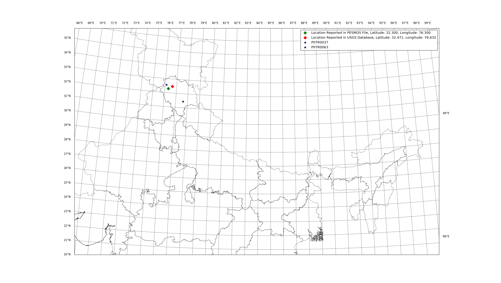

# 20121002-Lahul Spiti1,Tuesday 02. October 2012, 4.9 [Mag Scale Unknown]

Item | Description
--- | ---
Events ID | PESMOS0229
Filename in PESMOS database | 20121002-Lahul Spiti1
Date | Tuesday 02. October 2012
Location | Latitude: 32.300, Longitude: 76.300
Station List | PIITR0037,PIITR0063
Magnitude in File [No Scale]| 4.9
USGS ID | usp000jtd8
USGS Magnitude | 4.80, mb
USGS Location | Latitude: 32.471, Longitude: 76.632
USGS Event Time | Tuesday 02. October 2012, 08:34:54
USGS Depth | 10.00 km

