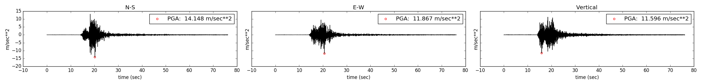
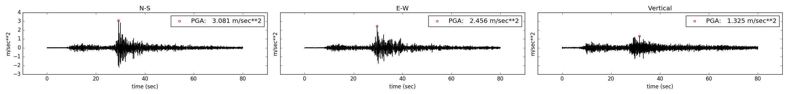

# 20121002-Lahul Spiti1,Tuesday 02. October 2012, 4.9 [Mag Scale Unknown]

__Item__ | __Description__
--- | ---
Events ID | PESMOS0229
Filename in PESMOS database | 20121002-Lahul Spiti1
Date | Tuesday 02. October 2012
Location | Latitude: 32.300, Longitude: 76.300
Station List | PIITR0037,PIITR0063
Magnitude in File [No Scale]| 4.9
USGS ID | usp000jtd8
USGS Magnitude | 4.80 mb
USGS Location | Latitude: 32.471, Longitude: 76.632
USGS Event Time | Tuesday 02. October 2012, 08:34:54
USGS Depth | 10.00 km

## PIITR0037, Station Data

__Item__ | __Description__
--- | ---
Station ID | PIITR0037
Site Class | A   Vs30 between 700 m/sec to 1400 m/sec
Location | Latitude: 32.555, Longitude: 76.126
Distance (km) |    32.7214 (PESMOS),   48.3568 (USGS) 

## PIITR0063, Station Data

__Item__ | __Description__
--- | ---
Station ID | PIITR0063
Site Class | A   Vs30 between 700 m/sec to 1400 m/sec
Location | Latitude: 31.448, Longitude: 77.630
Distance (km) |   157.3122 (PESMOS),  147.6603 (USGS) 
